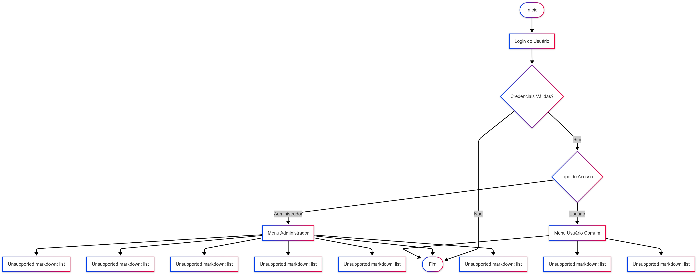

# ⚡ GSCS1SEM - Sistema de Gerenciamento de Falhas e Alertas

## Integrantes

- Guilherme Daher 98611
- Gustavo Akio 550241
- Heitor Farias 551539

### Link do vídeo no Youtube 

 - Link do vídeo no youtube: [Vídeo GS](https://youtu.be/Y9a_cel-eFs)


### Fluxograma da solução



##  Finalidade do Sistema

O **GSCS1SEM** é um sistema acadêmico de console desenvolvido em **C#** que permite gerenciar **falhas** e **alertas** relacionados a ocorrências técnicas, como quedas de energia ou problemas operacionais.  
O objetivo é simular um ambiente de controle em que:

- **Administradores** podem cadastrar, listar e excluir falhas, além de gerenciar alertas.
- **Usuários comuns** podem cadastrar falhas e visualizar alertas em tempo real.

##  Como Executar

###  Pré-requisitos

- Acesso ao **Oracle Database** (como o servidor `oracle.fiap.com.br`).
- Editor de código como **Visual Studio**.

###  Login de Teste:

Criamos um usuário administrador para poder ser testado as funcionalidades!

 - Usuário: admin

 - Senha: admin

 - Tipo de Acesso: Administrador (0)

Para teste de usuário comum, recomendamos registrar um na hora e testar

###  Estruturas de pastas
```
GSCS1SEM/
│
├── Controller/         # Lógica de controle (chama serviços e manipula regras)
│   ├── FalhaController.cs
│   └── AlertaController.cs
│
├── Model/              # Modelos de dados (Entidades)
│   ├── Falha.cs
│   ├── Alerta.cs
│   └── Usuario.cs
│
├── Repository/         # Acesso ao banco de dados Oracle
│   ├── FalhaRepository.cs
│   ├── AlertaRepository.cs
│   └── UsuarioRepository.cs
│
├── Service/            # Regras de negócio e menus
│   ├── MenuService.cs
│   └── UsuarioService.cs
│
├── Program.cs          # Ponto de entrada do programa
├── GSCS1SEM.csproj     # Configurações do projeto .NET
└── README.md           # Este arquivo
```


###  Dependências
 - Oracle.ManagedDataAccess (driver de acesso ao banco Oracle)
